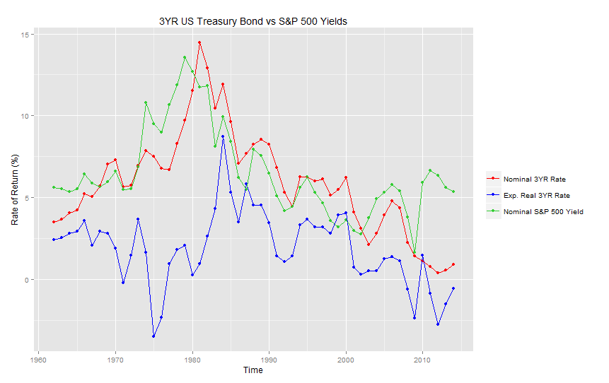
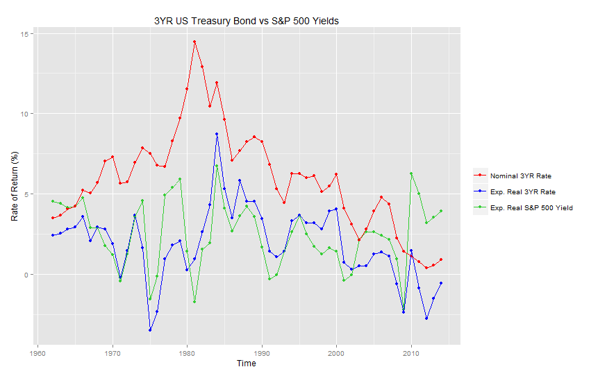

# The Effect of Interest Rates on S&P 500 Yields

This is the GitHub repository for my Math 241 - Case Studies in Statistical Analysis Term Project

                               

## Comparing Stock Yields with Bond Rates

